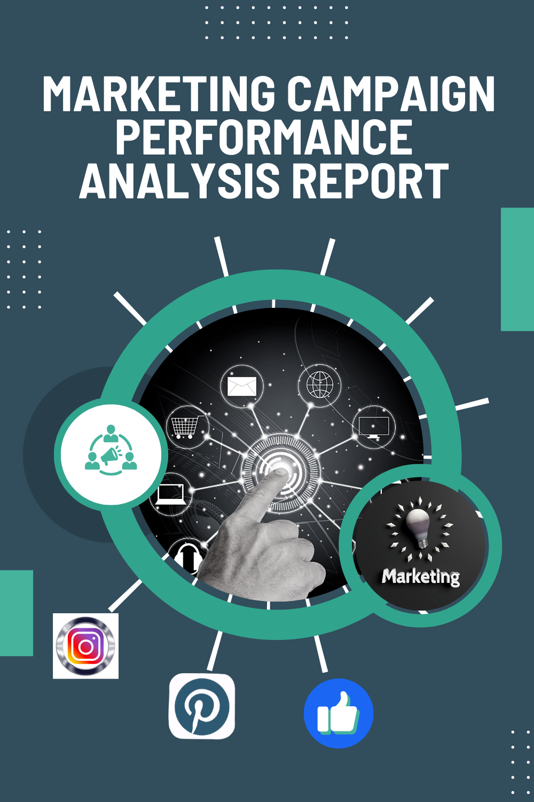

# MARKETING CAMPAIGN PERFORMANCE ANALYSIS

---
## EXECUTIVE SUMMARY
The report analyzes the performance of multiple Marketing campaigns (Fall, Spring and Summer) across various channels (Facebook, Instagram, Pinterest) for Q2 and Q3. The objective of the campaign is to generate more leads, optimize and improve conversation rate. Key performance indicators like, Total & Average Impressions, Total clicks, Total Engagements, Cost-Per click (CPC) Click Through Rate (CTR) , conversion rate and ROI were tracked to measure the campaign effectiveness. Trend analysis was done to observe seasonal patterns and monthly performance trends. Based on the results of the analysis, the following findings were observed.

## Key Findings:
-	Summer Campaign had the highest ROI (92.9%), making it the most successful.
-	Fall Campaign had high engagement but the lowest conversion rate, signaling challenges in converting leads.
-	Pinterest showed the highest ROI (2150.70%), proving extremely effective at converting spend into revenue.
-	London had the highest engagement, while Birmingham had the best conversion rate (28%).
-	Mobile generated the most impressions, but Desktop had the highest conversion rate.
-	Summer months (June-August) saw strong conversion rates, while Fall (September-November) experienced a decline, particularly in September.
## Recommendations:
-	Maximize Summer Performance: Invest in targeted campaigns during the summer months, as they show the highest conversion rates and ROI.
-	Address Fall Decline: Review and optimize fall campaigns, particularly in September, to mitigate performance drops.
-	Platform Optimization: Continue leveraging Pinterest for high conversion rates, while refining strategies for Instagram and Facebook to boost their performance.
-	Seasonal Targeting: Design campaigns tailored to holiday periods in October and November to maintain high engagement and conversion rates.

## Introduction
In this project, I will be assuming the role of a BI consultant who has just been hired by this fictional Marketing company, As they look to optimize their ad spend. they’ve brought me in to analyze interesting patterns and trends in their data and help them make informed decisions.

## Scope of the Campaign.
Our company has been running multiple marketing campaigns across various channels (Facebook, Instagram, Pinterest) to promote our products. We have collected detailed data on daily ad performance, including metrics like impressions, clicks, spend, conversions, and engagement (likes, shares, comments). This project aims to analyze this data to gain insights into the effectiveness of our campaigns, optimize our ad spend, and improve future marketing strategies.
## Objectives:
-	Evaluate Campaign Performance: Assess the overall performance of each campaign in terms of reach, engagement, and conversions.
- Channel Effectiveness: Determine which advertising channels are driving the best results.
-	Geographical Insights: Identify the cities that show the highest engagement and conversion rates.
-	Device Performance: Understand how ads perform across different devices.
-	Ad-Level Analysis: Analyze the performance of individual ads to identify high-performing creatives.
-	ROI Calculation: Calculate the return on investment (ROI) for each campaign.
-	Time Series Analysis: Track the performance trends over time to identify patterns and seasonal effects.

## Data Overview
### Data Source
The data was provided by SPLENDOR ANALYTICS on Marketing Campaign Performance.
### Data Description
The dataset contains the following columns:
- Campaign: Name of the marketing campaign.
-	Date: Date for daily ad performance metrics.
-	City/Location: Cities that were targeted by the campaign.
-	Latitude: Latitude for the cities.
-	Longitude: Longitude for the cities.
-	Channel: Channel where ads were displayed (Facebook, Instagram, Pinterest).
-	Device: Device from which ads were viewed.
-	Ad: Ads used within a campaign.
-	Impressions: Daily impressions (times ad was shown to a viewer) for each ad.
-	CTR, %: Daily average click-through rate for each ad.
-	Clicks: Daily clicks for each ad.
-	Daily Average CPC: Daily average cost-per-click for each ad.
-	Spend, GBP: Total daily amount of advertising spending for each ad, in GBP.
-	Conversions: Total daily purchases attributed to a specific ad.
-	Total conversion value, GBP: Total amount in GBP received from purchases attributed to a specific ad.
-	Likes: Total daily likes (or other reactions) per ad.
-	Shares: Total daily shares per ad. For simplicity, each Pin on Pinterest is counted as a share.
-	Comments: Total daily comments per ad.

### Data Preparation:
A Database called Marketing_Data Database was created with SQL Query `CREATE DATABASE Marketing Data;`. A table was created also.
The Dataset provided was in a CSV Format embedded in a zip file. The data was first extracted, Transformed and cleaned thoroughly by utilizing the Data-transformation capabilities of Power Query, before Imported into SQL. The dataset was examine for inconsistence, errors, null values, incorrect data type, spelling errors and maintain the integrity of the information, ensuring reliable insights and informed decision-making.
### Data/Database profiling and cleaning.
Data profiling is crucial as it provides a comprehensive understanding of the quality, structure, and relationships within a dataset, ensuring that potential issues are identified early on. Cleaning the data is equally vital to enhance accuracy, eliminate inconsistencies.
- `EXEC SP_HELP 'MARKETINGS'` 
- `UPDATE Marketings`
- `SET CTR=REPLACE (CTR,'%',' ');`
 - `ALTER TABLE MARKETINGS`
 - `ALTER COLUMN CTR DECIMAL (5,2);`

## Methodology
-	Descriptive Statistics: Basic statistics were computed for each metric to get an overview of the data.
-	Aggregation and Grouping: SQL queries were used to aggregate data by different dimensions (campaign, channel, city, device).
-	Visualization: Visualizations were created to identify trends and patterns.
-	ROI and Conversion Analysis: ROI was calculated, and conversion metrics were analyzed to assess campaign effectiveness.
-	Reporting: Data-driven Insights and findings were compiled into a comprehensive report with actionable insights and recommendations.

## Tools used:
-	SQL Server for Data Cleaning, Transformation and Manipulation (Analysis).
-	Microsoft Excel for visualization.
-	Power Query for ETL
-	Microsoft Word for Report.
-	Microsoft Power Point for Presentation.

## Key Performance Indicators
-	Engagements: The Sum-Total of likes, shares and comments from a particular ad.
-	Click through rate: The percentage of audience who clicked on the ad after viewing
-	Average Cost Per click: The Average cost per click
-	Return on investment: The Financial return on investment
-	Conversion rate: The percentage of users who take a desired action out of the total audience.

## KEY Business QUESTIONS TO ANSWER / Problem Statement.
1. Campaign Performance:
-	Which campaign generated the highest number of impressions, clicks, and conversions?
-	What is the average cost-per-click (CPC)  and click-through rate (CTR) for each campaign?
2. Channel Effectiveness: 
-	Which channel has the highest ROI?
-	How do impressions, clicks, and conversions vary across different  channels?  
3. Geographical Insights:
-	Which cities have the highest engagement rates (likes, shares, comments)?  
-	What is the conversion rate by city?
4. Device Performance:	
-	How do ad performances compare across different devices (mobile, desktop, tablet)?
-	Which device type generates the highest conversion rates?
5. Ad-Level Analysis:
-	Which specific ads are performing best in terms of engagement and conversions?
-	What are the common characteristics of high-performing ads?
6. ROI Calculation:
-	What is the ROI for each campaign, and how does it compare across different channels and devices?
-	How does spend correlate with conversion value across different campaigns?
7. Time Series Analysis:
- Are there any noticeable trends or seasonal effects in ad performance over time?

### Campaign Performance:
1. Which campaign generated the highest number of impressions, clicks, and conversions? 
- **Impressions:** Fall had the highest Impressions of **6,434,259**, followed by Spring with impressions of 4,751,611, and summer with 3,459,578.
- **Clicks:** Fall had the highest clicks of **85,120**, Followed by Spring (57,620) and Summer with clicks of 38,816.
- **Conversion:** Fall had the highest Conversion of **14,889**, followed by Summer (12,753) and Spring (12,753)

**Insights:**
- The Fall campaign generated the highest impressions and clicks, maximizing brand awareness but had a lower conversion rate, potentially missing out on conversion opportunities despite its wide reach.
- The Spring campaign achieved a balanced approach with strong conversion efficiency, effectively turning a moderate number of clicks into conversions. This indicates good efficiency in converting clicks into conversions
- The Summer campaign, despite its low Impressions and clicks, it had the highest conversion rate. This suggests that it was highly targeted and effective in turning clicks into conversions meaning it was highly effective in converting a smaller audience, driving excellent results from fewer impressions and clicks.

**Recommendations:**
- Optimize conversions for fall Campaign: Despite good engagement, the conversion rate could be improved by Optimizing the campaign.
- Increase reach for Spring campaign: Given the high conversion efficiency, the campaign could benefit from targeting a larger audience to capture more conversions.
- Refine targeting: Narrow down the audience for even higher conversion rates and engagement.
- Scale up the summer campaign: The extremely high conversion rate suggests a well-targeted strategy. Increasing the reach could maximize conversions.
- The tactics used in the summer campaign should be applied to other campaigns to improve conversion rates across the board.

2. What is the average cost-per-click (CPC) and click-through rate (CTR) for each campaign?

**Average-cost Per click (Avg CPC):**
- Summer: £0.084 
- Spring: £0.050
- Fall: £0.037
- 
**Click-Through rate (CTR)**
- Summer: 1.12% 
- Spring: 1.21%
- Fall: 1.32%

**Insights:**
- The Summer campaign had the highest cost per click (£0.084) but the lowest click-through rate (1.12%), suggesting that it's more expensive yet less engaging.
- The Spring campaign balanced cost and engagement, with a moderate CPC (£0.050) and CTR (1.21%), indicating solid performance.
- The Fall campaign was the most cost-efficient with the lowest CPC (£0.037) and the highest CTR (1.32%), making it the most effective in driving engagement for the money spent.

**Channel Effectiveness:** 

1. Which channel has the highest ROI?
- Pinterest: Had the Highest ROI of 2150.70%
- Instagram: 980.10%
- Facebook: 475.90%

**Data-Driven Insights**
Pinterest generated the highest ROI at 2150.70%, indicating that it is exceptionally effective at converting spending into revenue. This suggests that audiences on Pinterest are highly engaged and likely respond positively to ads.
Instagram follows with an ROI of 980.10%, which is also very strong. This platform appears to be a significant driver of returns
Facebook Had a ROI of 475.90%, which is lower than the other two channels but still indicates a positive return on investment. This suggests that while it is not the top performer, it still contributes to overall profitability.

**Recommendations:**
- Increase investment in Pinterest.
- Evaluate and test new strategies on Facebook to improve its performance.
- Consider cross-promoting content between platforms to drive traffic and enhance overall results
Implementing these strategies will help to optimize marketing efforts and maximize ROI across channels.

2. How do impressions, clicks, and conversions vary across different channels

**Impression:**
- Facebook: 5,439,591
- Instagram:4,840,638
- Pinterest:4,365,220

**Clicks:**
- Facebook: 69,961
- Instagram: 68,655
- Pinterest: 42,982

**Conversions:**
-Facebook: 13,132
- Instagram: 15,590
- Pinterest: 11,530

**Insights:**
- Facebook has the most impressions (5,439,591) but a lower conversion rate compared to Instagram. This means Facebook is effective for reach but needs better engagement strategies to improve conversions.
- Instagram leads in conversions with 15,590, indicating it’s highly efficient at driving action from users. Instagram is the most efficient- conversion channel.
- Pinterest has the fewest impressions but generates competitive conversions (11,530) with a strong conversion efficiency. Pinterest converts well with fewer impressions, showing it attracts a highly intent-driven audience.

**Geographical Insights:**
1. Which cities have the highest engagement rates (likes, shares, comments)?  
Engagements: London had the highest engagements (285,706), followed by Manchester (276,159) and Birmingham Had the lowest engagements (237,874)

**Data-driven Insights:**
- London had the highest engagements (285,706), making it the most active city with a high audience base.
- Manchester follows closely with 278,159 engagements, indicating strong engagement.
- Birmingham has the lowest engagements at 237,874, but still shows significant activity.
- Run city-specific campaigns tailored to local trends in London and Manchester, while offering special incentives for Birmingham.

2. What is the conversion rate by city?
1. Birmingham: 28%
2. Manchester: 22%
3. London: 17%

**Insights:**
-	Birmingham had the highest conversion rate (28%), indicating a highly action-oriented audience. 
-	Manchester had a moderate conversion rate (22%), showing good engagement and conversion potential.
-	London had the lowest conversion rate (17%), despite high engagement, suggesting room for optimization.
  
**Recommendations:**
-	Invest more in Birmingham to maximize returns, given its strong conversion rate.
-	Optimize London’s conversion strategies to maximize its high engagement coverage.
-	Personalize campaigns for each city based on their unique conversion behavior.
-	Analyze London’s conversion barriers to improve performance and address issues in the user journey.

**Device Performance:**
1. How do ad performances compare across different devices (mobile, desktop, tablet)?
- Impressions: Impressions: Mobile drives the most impressions (8,845,239)
- Clicks: Mobile has the highest clicks (92,766)
- Conversions: Desktop has the highest conversions (21,310)

**Performance by Device:**
- Impressions: Mobile drives the most impressions (8,845,239)
- Clicks: Mobile had the highest clicks (92,766)
- Conversions: Desktop had the highest conversions (21,310)

2. Which device-type generates the highest conversion rates?
Conversion Rate:
-	Desktop: 23%
-	Mobile: 20%

**Insights:**
- Mobile drives the most impressions (8,845,239) and clicks (92,766) but a lower conversion (18,942). It has a lower conversion rate (20%). This suggests that while mobile drives more visibility and engagement, it is less efficient at converting clicks into sales or actions.
- Desktop had lower impressions (5,800,160) and clicks (88,832) but achieved a higher number of conversions (21,310). This indicates that Desktop users are more likely to convert, suggesting a stronger purchase intent. it Has as conversion rate of 23%.

**Recommendations**
-	Improve the mobile user experience to boost conversions (e.g., better landing pages, faster checkout).
-	Capitalize on desktop’s high conversion rate by continuing to target this audience.
-	Test mobile-specific campaigns and ensure a seamless experience across devices to capture conversions from users switching between mobile and desktop.

**Ad-Level Analysis**
1. Which specific ads are performing best in terms of engagement and conversions?

**Engagements by Ads:**
-	Discount: Had highest engagements (459,629).
-	Collection: Had a lower engagement (342,110).

**Conversions:**
-	Discount: Had the highest Conversions (21,183)
-	Collection: 19,069

**Insights:**
-	Discount ads drive more engagements.
-	Collection ads have fewer engagements but a higher conversion rate.

**Recommendations:**
-	Continue using discount ads for visibility but optimize them to improve conversion rates.
-	Target Collection ads to users with higher intent to maintain strong conversion performance.
-	Test combining discount and collection ads to boost both engagement and conversions.

2. What are the common characteristics of high-performing ads?
High-performing ads typically share the following characteristics:
-	Clear Message: They communicate the value proposition concisely.
-	Strong Visuals: High-quality images or videos that resonate with the audience.
-	Targeted Audience: Tailored to specific demographics and interests.
-	Emotional Appeal: Evoke emotions to foster engagement.
-	Relevance: Align with current trends and audience needs.
-	Social Proof: Use testimonials or reviews for credibility.
-	Mobile Optimization: Designed for easy viewing on mobile devices.

**ROI Calculation:**
1. What is the ROI for each campaign, and how does it compare across different channels and devices?

**ROI Insights:**
-	Summer Campaign: Highest ROI at 92.9%, indicating the most Successful and best overall performance.
-	Spring Campaign: Strong ROI of 90.1%.
-	Fall Campaign: Lowest ROI at 89.4%.
Overall, all campaigns performed well, with minimal differences in ROI, but the summer campaign stood out as the top performer.

**Insight:**
- Summer Campaign: Generate the Highest ROI for both desktop (93.1%) and mobile (92.6%), with minimal difference between devices.
- Spring Campaign: Desktop (90.4%) outperformed mobile (89.6%), but both performed well.
- Fall Campaign: Lowest performance overall, with desktop (89.9%) higher than mobile (88.9%).
Key Takeaway: Desktop consistently outperformed mobile across all campaigns, with the summer campaign delivering the best results on both devices, and the Fall campaign showing the weakest performance, especially on mobile.

**Data-Driven Insights:**
-	Pinterest:
-	Highest ROI across all campaigns with 96% in Spring and Summer and 95% in Fall, indicating it is the most effective platform for driving conversions.  It shows strong performance across different seasons.
-	Instagram:
-	Strong performance with 93% ROI in Summer, 90% in Spring, and 89% in Fall, making it a valuable platform, especially during seasonal campaigns.
-	Facebook:
-	Lowest ROI at 90% in Summer, declining to 80% in Spring and 78% in Fall, suggesting a need for strategy reevaluation on this platform.

**Key Takeaway:**
Brands should prioritize Pinterest for high ROI campaigns, leverage Instagram for seasonal marketing, and reassess Facebook strategies due to declining returns. 

2. How does spend correlate with conversion value across different campaigns?
-	Fall Campaign: Total Spend of £79,281 and a conversion value of £749,005.99 with an ROI of 843.51%.
-	Spring Campaign: Total Spend of £49,548 and a conversion value of £498,285.06 with an ROI of 903.76%
-	Summer Campaign: Lowest spend of £34,352, and conversion value of £484,409.21. highest ROI at 1,308.88%,

**Correlation Insights:**
- There is a positive correlation between total spend and total conversion value, but spending efficiency varies across campaigns.
- The Summer campaign achieved high conversion value with the lowest spend, indicating effective targeting or messaging.
-	The Fall campaign had the highest spending but lower ROI, suggesting the need for optimization to improve efficiency.

**Recommendations**
1.	Emphasize Efficient Spending: Implement strategies to maintain high conversion values with lower investment, as seen in the summer campaign.
2.	Analyze the Fall Campaign: Investigate the Fall campaign for opportunities to enhance spending efficiency while maintaining conversion levels.
3.	Refine Targeting: Continuously optimize audience targeting and messaging across all campaigns to maximize conversion value relative to spend.

**Time Series Analysis**
1. Are there any noticeable trends or seasonal effects in ad performance over time

**Overall Growth:**
Total engagements rose from 73,488 in March to a peak of 99,464 in October, reflecting a general upward trend.
Monthly Insights:
-	March to June: Steady growth with monthly increases:
-	April: 76,282 (up 3.6%)
-	May: 84,503 (up 10.0%)
-	June: 94,970 (up 12.3%)
-	July to August: Decline to 93,211 in July, further dropping to 87,072 in August (down 6.6%).
-	September to October: Rebound to 95,317 in September and peak at 99,464 in October (up 4.7%).
-	November: Slight drop to 97,432, still above August levels.

**Seasonal Patterns**
- Lower engagement in the summer (July and August) suggests a seasonal influence, with October's peak likely tied to holiday preparations.
Key Takeaways:
- Overall engagement shows strong growth, but fluctuations highlight the need for strategies to enhance engagement during summer dips.

**Recommendation**
- Maximize Engagement in Peak Months: Target campaigns in September and October.
- Boost Summer Engagement: Develop strategies to raise engagement during July and August.
- Continue Monitoring Trends: Regularly track monthly engagement to refine future 
strategies.

**Insights:**
- Highest Conversion Rates: Occurred in June (34%), July (32%), and August (31%).
- Steady Start: Conversion rates from March to May ranged between 20-23%.
- Post-Summer Decline: A significant drop to 15% in September, followed by a slight recovery to 19% in November.
Key Insights:
- Summer months (June-August) showed the strongest conversion rates, while fall months (September-November) experienced a decline, particularly in September.

**Recommendations**
- Maximize efforts during high-conversion summer months.-
- Investigate and improve strategies to counteract the decline in fall conversions.

### Conclusion
Based on the analytical results and data-driven insights, the marketing campaigns (Summer, Spring and Fall) were successful overall, with notable strengths and weakness across key channels and devices, Suggesting need for improvement and optimization. Channels such as Pinterest and Instagram excelled, generating high engagement and conversion rates, while other platforms showed potential for further optimization. Performance varied across demographics and devices, highlighting the need for more targeted strategies in the future. This campaign has provided a solid foundation for future growth, and the insights and recommendations gained will be crucial in shaping more effective marketing strategies moving forward.

